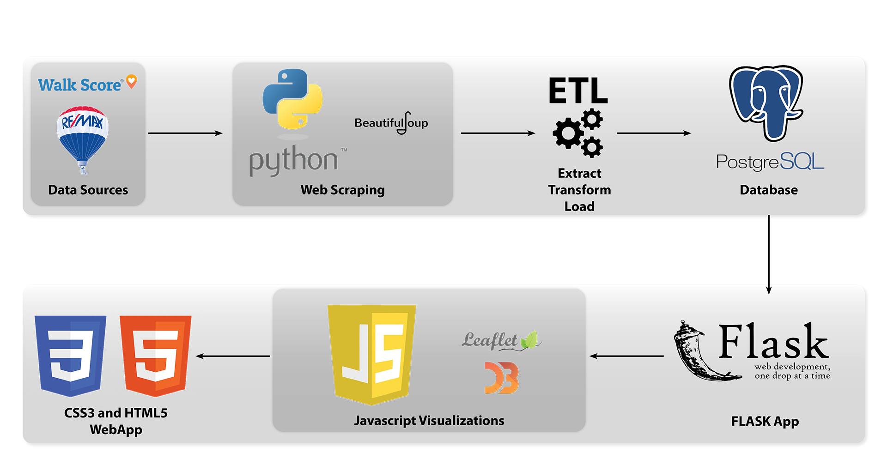

# Flask Web Application

## Description

Navigating the complexities of buying a house could be easier if users could see immediately an interactive dashboard showing them the range of property prices in neighbourhoods they could be interested in on a map.

## Objective: 

To create three visualizations that show:

•	Range of house prices, red being the most expensive, yellow being the median prices and green being the cheapest available using a HeatMap.

•	A Clustermap showing the available houses for sale in the area.

•	D3 Scatterplot would show relationships between the data values

## Visuals
 
Screenshots of how a user can select visualisation options: Update with pics after project is complete and run. This will give the user directions on how to use the program.

## Tools and Libraries Used:

•	BeautifulSoup

•	D3.js.

•	Leaflet

•	Javascript

•	Jupyter Notebook

•	Mapbox

•	Mongo DB

•	Python

•	Flask

•	Web scraping

## Flow Diagram

## RoadMap

Expanding to other cities in Canada

## Code

from flask import Flask, render_template, jsonify
from flask_sqlalchemy import SQLAlchemy
import psycopg2

app = Flask(__name__)

db = SQLAlchemy()

# connect to the db
con = psycopg2.connect(
            host="localhost",
            database="realestate_db",
            user="postgres",
            password="123"
)

def calgary_data_fun():
    cur = con.cursor()

    # execute query
    cur.execute("SELECT json_agg(t) FROM (SELECT cl.price, cl.address, cl.postal_code, cl.bed, cl.full_bath, cl.half_bath, cl.property_area, cl.property_type, s.walk_score, s.bike_score, s.transit_score, coord.lat, coord.long FROM calgary AS cl JOIN score AS s ON cl.postal_code = s.postal_code JOIN coordinates AS coord ON s.postal_code = coord.postal_codes WHERE cl.price < 1000000 AND cl.property_area < 4000 AND s.walk_score > 5 AND s.bike_score > 0 AND s.transit_score > 0)t")

    #cur.execute("SELECT cl.price, cl.address, cl.postal_code, cl.bed, cl.full_bath, cl.half_bath, cl.property_area, cl.property_type, s.walk_score, s.bike_score, s.transit_score, coord.lat, coord.long FROM calgary_df AS cl JOIN score_df AS s ON cl.postal_code = s.postal_code JOIN coordinates_df AS coord ON s.postal_code = coord.postal_codes")

    calgary_data = cur.fetchall()

    return calgary_data

def bar_fun():
    cur = con.cursor()

    # execute query
    cur.execute("SELECT json_agg(t) FROM (SELECT cl.price, cl.address, cl.postal_code, cl.bed, cl.full_bath, cl.half_bath, cl.property_area, cl.property_type, s.walk_score, s.bike_score, s.transit_score, coord.lat, coord.long FROM calgary AS cl JOIN score AS s ON cl.postal_code = s.postal_code JOIN coordinates AS coord ON s.postal_code = coord.postal_codes WHERE cl.price < 1000000 AND cl.property_area < 4000 AND cl.property_type IS NOT null)t")

    #cur.execute("SELECT cl.price, cl.address, cl.postal_code, cl.bed, cl.full_bath, cl.half_bath, cl.property_area, cl.property_type, s.walk_score, s.bike_score, s.transit_score, coord.lat, coord.long FROM calgary_df AS cl JOIN score_df AS s ON cl.postal_code = s.postal_code JOIN coordinates_df AS coord ON s.postal_code = coord.postal_codes")

    bar_data = cur.fetchall()
    # print(calgary_data)

    # close cursor
    #cur.close()

    # close the connection
    #con.close()

    return bar_data

@app.route("/")
def home():

    # create cursor
    cur = con.cursor()

    # execute query
    cur.execute("SELECT json_agg(t) FROM (SELECT cl.price, cl.address, cl.postal_code, cl.bed, cl.full_bath, cl.half_bath, cl.property_area, cl.property_type, s.walk_score, s.bike_score, s.transit_score, coord.lat, coord.long FROM calgary AS cl JOIN score AS s ON cl.postal_code = s.postal_code JOIN coordinates AS coord ON s.postal_code = coord.postal_codes WHERE cl.price < 1000000 AND cl.property_area < 4000)t")

    #cur.execute("SELECT cl.price, cl.address, cl.postal_code, cl.bed, cl.full_bath, cl.half_bath, cl.property_area, cl.property_type, s.walk_score, s.bike_score, s.transit_score, coord.lat, coord.long FROM calgary_df AS cl JOIN score_df AS s ON cl.postal_code = s.postal_code JOIN coordinates_df AS coord ON s.postal_code = coord.postal_codes")
    
    calgary_data = cur.fetchall()
    # print(calgary_data)

    # close cursor
    #cur.close()

    # close the connection
    #con.close()

    # Return template and data
    return render_template("index.html", calgary=[i for i in calgary_data])

@app.route("/jsonified")
def calgary_data():
    """Return the Calgary data as json"""
    calgary = calgary_data_fun()
    # calgary = calgary[:15]
    return jsonify(calgary)

@app.route("/bardata")
def bar_data():
    bar = bar_fun()
    return jsonify(bar)

@app.route("/viz")
def viz():
    return render_template("viz.html")

@app.route("/scatter")
def scatter():
    return render_template("scatter.html")

@app.route("/bar")
def bar():
    return render_template("bar.html")

@app.route("/data")
def data():
    # create cursor
    cur = con.cursor()

    # execute query
    cur.execute("SELECT cl.price, cl.address, cl.postal_code, cl.bed, cl.full_bath, cl.half_bath, cl.property_area, cl.property_type, s.walk_score, s.bike_score, s.transit_score, coord.lat, coord.long FROM calgary AS cl JOIN score AS s ON cl.postal_code = s.postal_code JOIN coordinates AS coord ON s.postal_code = coord.postal_codes WHERE cl.price < 1000000 AND cl.property_area < 4000")

    #cur.execute("SELECT cl.price, cl.address, cl.postal_code, cl.bed, cl.full_bath, cl.half_bath, cl.property_area, cl.property_type, s.walk_score, s.bike_score, s.transit_score, coord.lat, coord.long FROM calgary_df AS cl JOIN score_df AS s ON cl.postal_code = s.postal_code JOIN coordinates_df AS coord ON s.postal_code = coord.postal_codes")
    
    calgary_data = cur.fetchall()
    # print(calgary_data)

    # close cursor
    #cur.close()

    # close the connection
    #con.close()

    # Return template and data
    return render_template("data.html", calgary=[i for i in calgary_data])

if __name__ == "__main__":
    app.run(debug=True)

## Homepage

## Cluster map

## Heat Map

## Scatter Plot

### Price vs (Walk Score, Transit Score, Bike Score)

### Price vs Property Area

### Property Area vs (Walk Score, Transit Score, Bike Score)

## Density Graph

## Authors and Acknowledgements

Thanks to Ahmad, Dami and Krutheka for their guidance and support

Team Members: Alexis Lawal, Dayo Thompson, Kirushan Kirubaharan and Sushant Deshpande

 
